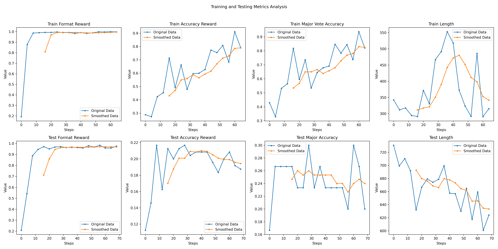
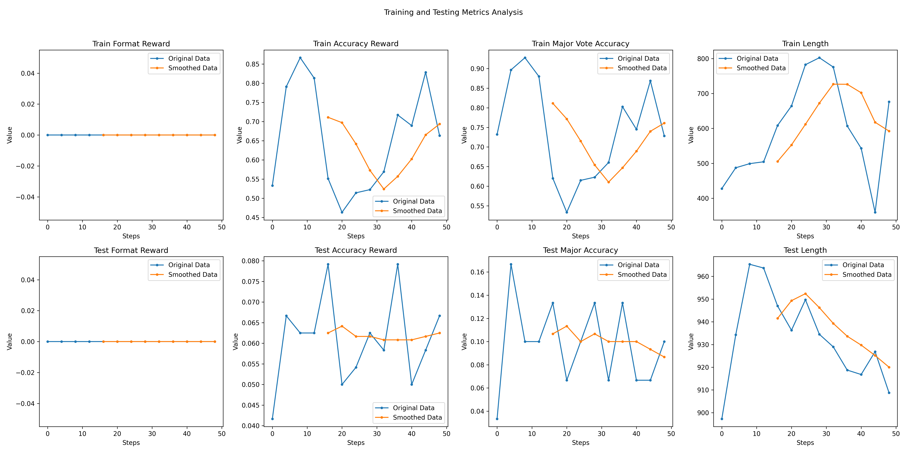

# ReasonLLM: Efficient LLM RL Fine-Tuning with Optimized Resource Utilization 🚀

[](https://github.com/loxs123/reason-llm)
[](https://opensource.org/licenses/MIT)

A cutting-edge framework for efficient GRPO algorithm implementation with VLLM acceleration, enabling large language model fine-tuning with lower GPU memory usage.

## 🌟 Key Features

**⚡ Ultra-Efficient Resource Usage**
- Lower GPU memory consumption than other methods
- Serialized sampling & training pipeline for optimal GPU utilization
- Dynamic-Batch processing
- Supports Lora fine-tuning

**🚀 Accelerated Performance**
- VLLM-powered sampling acceleration

**🧩 Production-Ready Design**
- Simple directory structure
- DeepSpeed Zero-2/3 integration
- Seamless HuggingFace ecosystem compatibility


| Challenge                  | Conventional Solutions | Our Approach               |
|----------------------------|------------------------|----------------------------|
| Slow Sampling Speed        | Transformers processing   | VLLM GPU acceleration      |
| High Min Batch Size Per Device  | group size   | 1   |
| Memory Inefficiency/High VRAM Requirements | Dual-model loading(vllm/train) | Single-model loading  |

## 🛠️ Getting Started

### Prerequisites
- NVIDIA GPU
- CUDA 12+
- Python 3.10+

### Installation
```bash
git clone https://github.com/loxs123/reason-llm.git
cd reason-llm
pip install -e . # If it fails, please install the required dependencies one by one.
# Warning: Since vLLM has strict requirements for the Torch version, installing it this way may break the original Torch environment. You may need to adjust the `requirements.txt` file as needed.
# export HF_ENDPOINT=https://hf-mirror.com # if use mirror
```

### Project Structure
```bash
├── data
│   ├── test.csv         # Test dataset
│   └── buffer.json      # Auto-generated training buffer
├── model                # Model directory
│   ├── config.json      # put your model here
│   ├── model.safetensors
│   └── tokenizer...
└── reason_llm            # Core framework
    ├── config.py         # Training configuration
    ├── reward_fn.py      # Reward Functions
    └── ...              # Implementation modules
```

### Launch Training

```bash
nohup python -u scripts/train.py &
```
### Training considerations
```plain_text
config_file : `reason_llm/config.py`
config list : `configs/*.py`
In multi-GPU training, do not forget update `num_processes` in `reason_llm/deepspeed_zero3.yaml` to match the number of GPUs.
deepseek : Need to modify `tokenizer_config.json` https://zhuanlan.zhihu.com/p/21465667399
```
### Some experiences and tips.

1. The larger the Lora rank, the better(≥128);

2. The larger the batch size, the better.

3. Removing samples with Advantage < 0 can lead to a better result.

4. Removing samples where reward.std() is too small (<0.1).

## 📊 Experimental Results
### Qwen2.5-7B

| Item            | detail                                         |
|---------------|--------------------------------------------|
| **Train Base Model** | [Qwen2.5-7B-Instruct](https://huggingface.co/Qwen/Qwen2.5-7B-Instruct) |
| **Train Type**  | full finetune                           |
| **Train Hardware** | 1×A100(80G)                          |
| **Train Time**  | 12h                                     |
| **Train Dataset**  | [xiaodongguaAIGC/X-R1-7500](https://huggingface.co/datasets/xiaodongguaAIGC/X-R1-7500) |
| **Test Dataset**  | [AIME 2024 Dataset](https://huggingface.co/datasets/Maxwell-Jia/AIME_2024) |
| **System Setting**  | ```A conversation between User and Assistant. The user asks a question, and the Assistant solves it. The assistant first thinks about the reasoning process in the mind and then provides the user with the answer. The reasoning process and answer are enclosed within <think> </think> and <answer> </answer> tags, respectively, i.e., <think> reasoning process here </think><answer> answer here </answer>``` |


[训练日志](log/log.out)
commit id:9de0d1fda962a42a9e6a6b4ed10ddf3f171dea3c

### Qwen2.5-3B

| Item            | detail                                         |
|---------------|--------------------------------------------|
| **Train Base Model** | [Qwen2.5-3B-Instruct](https://huggingface.co/Qwen/Qwen2.5-3B-Instruct) |
| **Train Type**  | full finetune                           |
| **Train Hardware** | 4×3090                               |
| **Train Time**  | 5h(1 epoch)                           |
| **Train Dataset**  | [xiaodongguaAIGC/X-R1-7500](https://huggingface.co/datasets/xiaodongguaAIGC/X-R1-7500) |
| **Test Dataset**  | [AIME 2024 Dataset](https://huggingface.co/datasets/Maxwell-Jia/AIME_2024) |
| **System Setting**  | ```A conversation between User and Assistant. The user asks a question, and the Assistant solves it. The assistant first thinks about the reasoning process in the mind and then provides the user with the answer. The reasoning process and answer are enclosed within <think> </think> and <answer> </answer> tags, respectively, i.e., <think> reasoning process here </think><answer> answer here </answer>``` |


[训练日志](log/log2.out)

commit id:9de0d1fda962a42a9e6a6b4ed10ddf3f171dea3c

The learning performance in the first 10 steps is good, but as training progresses, the model's performance starts to fluctuate. However, its overall performance still surpasses the baseline model.


## 📚 References
1. [VLLM Official Implementation](https://github.com/vllm-project/vllm)
2. [DeepSeek-R1 Model](https://huggingface.co/deepseek-ai/DeepSeek-R1-Distill-Qwen-7B)
3. [TRL Library](https://github.com/huggingface/trl)
4. [AIME Dataset](https://huggingface.co/datasets/di-zhang-fdu/AIME_1983_2024)
5. [X-R1](https://github.com/dhcode-cpp/X-R1)
---

*Empowering efficient LLM fine-tuning for everyone* 🤖
